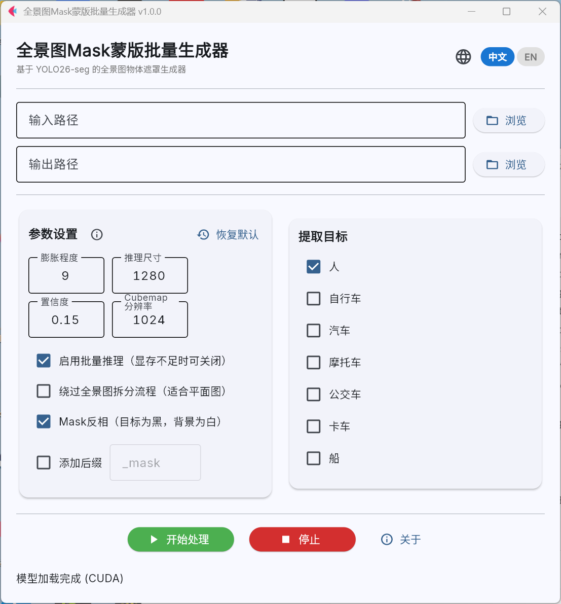
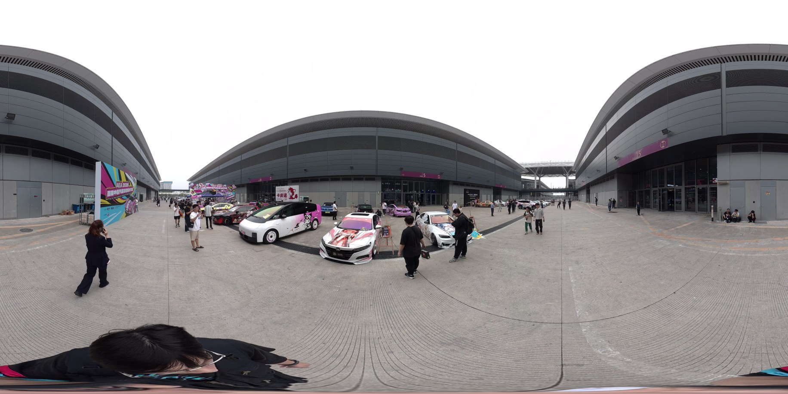
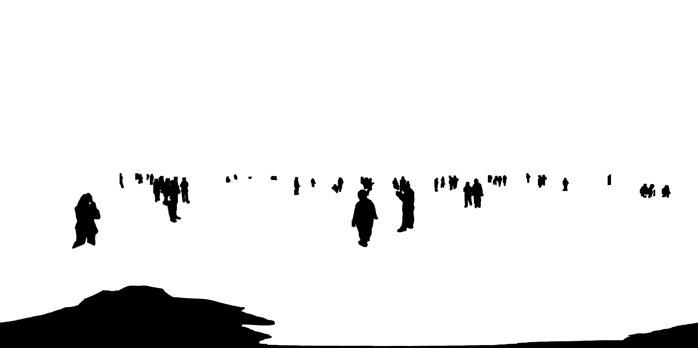
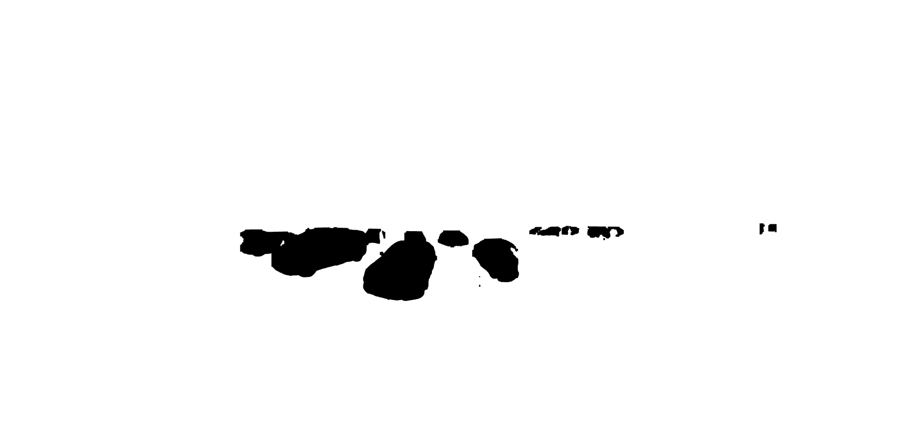

# MaskYOLO - 全景图 Mask 蒙版批量生成器

<div align="center">


**基于 YOLO26-seg 实例分割的全景图物体遮罩生成器**

</div>

---

## 简介

MaskYOLO 是一款专为 360° 全景图像打造的物体遮罩生成工具。

基于 Ultralytics YOLO26 实例分割模型，自动检测并提取全景图中的指定目标（人物、车辆等），输出高质量二值 Mask 图，

可无缝对接 3DGS（3D Gaussian Splatting）等后续渲染管线。

### 特性

- **高精度实例分割** — 基于 YOLO26-seg 最新模型，支持多类别检测
- **全景图专用流程** — ERP → Cubemap → YOLO 推理 → ERP，规避因全景图畸变导致YOLO识别性能下降的问题
- **现代化 GUI** — 基于 Flet，支持中英文实时切换
- **文件名自定义** — 支持为输出文件添加自定义后缀

---

## 界面预览



---

## 依赖

| 依赖 | 版本 | 说明 |
|------|------|------|
| [ultralytics](https://github.com/ultralytics/ultralytics) | ≥ 8.4.0 | YOLO26 模型推理 |
| [opencv-python](https://github.com/opencv/opencv) | ≥ 4.8.0 | 图像处理与 Mask 后处理 |
| [numpy](https://github.com/numpy/numpy) | ≥ 1.24.0 | 数值计算 |
| [py360convert](https://github.com/sunset1995/py360convert) | ≥ 0.1.0 | ERP ⇔ Cubemap 全景投影转换 |
| [flet](https://github.com/flet-dev/flet) | ≥ 0.25.0 | GUI 框架 |
| [flet-desktop](https://github.com/flet-dev/flet) | ≥ 0.25.0 | Flet 桌面端支持 |
| [torch](https://github.com/pytorch/pytorch) | ≥ 2.0.0 | 深度学习框架（CUDA 12.4 优化） |
| [torchvision](https://github.com/pytorch/pytorch) | ≥ 0.15.0 | 计算机视觉工具 |

> **提示**：首次运行程序时会自动从 Ultralytics 官方源下载 `yolo26n-seg.pt` 预训练权重（约 7 MB），如遇下载失败可手动从 [Ultralytics 官网文档](https://docs.ultralytics.com/models/yolo26/#yoloe-26-open-vocabulary-instance-segmentation) 获取并放入项目根目录。

---

## 环境部署（UV）

```bash
# 克隆仓库
git clone https://github.com/dtpoi/YOLO26-seg-mask.git
cd YOLO26-seg-mask

# 同步依赖（自动创建 .venv 并安装所有依赖）
uv sync

# 运行程序
uv run python main.py
```

> **注意**：Windows 系统上 `uv sync` 会自动配置 PyTorch CUDA 12.4 版本以获得最佳 GPU 推理性能。如需强制使用 CPU，请设置环境变量 `CUDA_VISIBLE_DEVICES=` 后再运行。

---

## 使用方法

### 1. 启动程序

```bash
uv run python main.py
```

### 2. 配置路径

- **输入路径** — 选择包含全景图（ERP 格式 `.jpg` / `.png`）或平面图的文件夹
- **输出路径** — 选择 Mask 图输出目录

### 3. 选择提取目标

在右侧面板勾选需要提取的目标类别（支持多选）：

| 类别 ID | 名称 | 说明 |
|:-------:|------|------|
| 0 | person / 人 | 人物主体 |
| 1 | bicycle / 自行车 | |
| 2 | car / 汽车 | |
| 3 | motorcycle / 摩托车 | |
| 5 | bus / 公交车 | |
| 7 | truck / 卡车 | |
| 8 | boat / 船 | |

### 4. 调整参数（可选）

| 参数 | 默认值 | 说明 |
|------|:------:|------|
| 膨胀程度 | 9 | Mask 边缘扩展像素数，值越大遮罩范围越宽（推荐 7–11） |
| 推理尺寸 | 1280 | YOLO 推理分辨率，越高越精细但越慢（推荐 1280 / 1920） |
| 置信度 | 0.15 | 检测阈值，越低越灵敏但可能误检（推荐 0.10–0.25） |
| Cubemap 分辨率 | 1024 | 全景模式下每面的宽（像素），仅全景模式有效（推荐 1024 / 1536） |
| 批量推理 | ✅ 开启 | 多面拼接后一次送入 GPU，提升利用率；显存不足可关闭 |
| 绕过全景拆分 | ❌ 关闭 | 勾选后跳过 Cubemap 转换，适合普通平面图 |
| Mask 反相 | ✅ 开启 | 勾选 → 目标为黑/背景为白（适用于 3DGS Mask 层） |
| 添加后缀 | ❌ 关闭 | 为输出文件名追加自定义后缀（默认 `_mask`） |

### 5. 开始处理

点击 **开始处理**，进度条实时显示处理进度。支持随时点击 **停止** 中断。

---

## 🎨 效果示例

### 人物 Mask（person）

| 原图 | Mask |
|:----:|:----:|
|  |  |

### 车辆 Mask（car / truck）

| 原图 | Mask |
|:----:|:----:|
|  |  |

---

## 技术原理

### 全景图处理流程

```
ERP 全景图 → ERP 转 Cubemap（6 面）→ 批量 YOLO 推理 → 合并 Mask → Cubemap 转 ERP → 输出
```

全景图采用等距柱状投影（ERP），存在严重的球面畸变，直接用标准 CNN 处理效果不佳。本项目采用经典 Cubemap 策略：

1. **ERP → Cubemap** — 使用 `py360convert` 将球面全景图展开为 6 个平面立方体面
2. **YOLO 分割** — 对每个面独立运行 YOLO26-seg 实例分割
3. **批量推理** — 6 面打包为一批送入 GPU，最大化GPU利用率
4. **Cubemap → ERP** — 将 6 个面的 Mask 合并投影回原始 ERP 格式
5. **后处理** — 膨胀操作扩展遮罩边缘，避免抠图残留

### 平面图模式

勾选「绕过全景图拆分流程」后，图片直接送入 YOLO 推理，跳过投影转换步骤，避免CPU瓶颈（因py360convert只能使用CPU计算），适合普通平面照片。

---

## 项目结构

```
maskYOLO/
├── main.py               # 程序入口
├── pyproject.toml        # UV 项目配置
├── uv.lock               # 依赖锁定文件
├── requirements.txt      # pip 兼容依赖列表
├── assets/
│   └── fonts/
│       └── SarasaUiSC-Regular.ttf   # 更纱黑体 UI 字体
├── examples/             # 示例图片
│   ├── UI.png            # 界面截图
│   ├── e1.jpg            # 原图
│   ├── mask1.png         # 人物 Mask
│   └── mask2.png         # 车辆 Mask
└── yolo26n-seg.pt        # YOLO26-seg 预训练权重（自动下载）
```

---

## 许可证

本项目基于 **AGPL-3.0** 开源。调用了 [ultralytics](https://github.com/ultralytics/ultralytics) 库。

请遵守相应协议条款，如需将本软件用于商业闭源项目，请联系 Ultralytics 获取商业授权。

---

## 致谢

- [Ultralytics](https://github.com/ultralytics/ultralytics) — YOLO26 模型
- [py360convert](https://github.com/sunset1995/py360convert) — 全景投影转换
- [Flet](https://flet.dev/) — Python GUI 框架
- [Sarasa Gothic](https://github.com/be5invis/Sarasa-Gothic) — 更纱黑体字体

---

<div align="center">

**如果对你有帮助，欢迎点个 ⭐ Star！**

</div>
